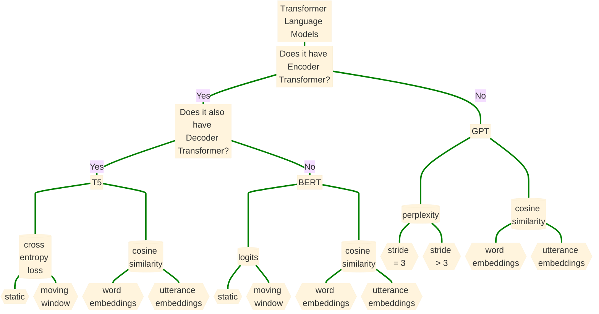
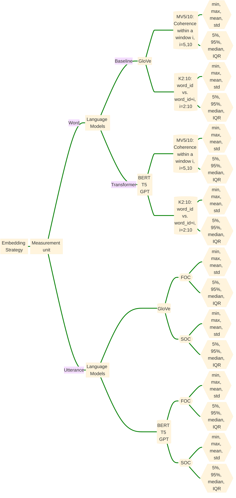

# Understanding semantic and pragmatic disorders

The goal of this project is to use language models to improve accuracy of detecting language disturbances in Schizophrenia Spectrum Disorder Speech. There are three major components in this transformer pipelien: 

    - Get embedding vectors from the language models.
    - Calcuate semantic similarities scores with different word/utterance level strategies.
    - Derive statistics from the similarities scores.

## Large language models taxonomy overview:

click on the tree node to see details



## Word/token level and Utterance level coherence measurements:

- K2:10: the word-to-word variability at K inter-word distances, with K ranging from 2 to 10
- MV5/10: the average semantic similarity of each word in 5- or 10- words window
- FOC: the first order cosine similarity of consecutive phrase vectors
- SOC: the second order cosine similarity between phrase separated by another intervening phrase




## Pipeline code skeletons:

- BERT: word level coherence computation
```py
  """
  Preprocesses text input in a way that BERT can interpret.
  """
  marked_text = "[CLS] " + text + " [SEP]"
  tokenized_text = tokenizer.tokenize(marked_text)
  indexed_tokens = tokenizer.convert_tokens_to_ids(tokenized_text)
  segments_ids = [1]*len(indexed_tokens)

  # convert inputs to tensors
  tokens_tensor = torch.tensor([indexed_tokens])
  segments_tensor = torch.tensor([segments_ids])

  """
  Obtains BERT embeddings for tokens, in context of the given response (list of sentences).
  """
  list_token_embeddings = get_bert_embeddings(tokens_tensor, segments_tensors, model)

  sentences = ["he eventually sold the shares back to the bank at a premium. the river flowed over the bank. the next day a little girl walked by the river bank and picked a bouquet of flowers."]
  token1 = context_embeddings[-20] # 'bank', with the intended meaning 'river bank'
  token2 = context_embeddings[-8] # 'bank', with the intended meaning 'river bank'
  print('similarity between bank (river) vs. bank (river): ', 1-cosine(token1, token2))

  token1 = context_embeddings[8] # 'bank', with the intended meaning 'financial department'
  token2 = context_embeddings[-2] # 'bank', with the intended meaning 'river bank'
  print('similarity between bank (financial) vs. bank (river): ', 1-cosine(token1, token2))

''' 
similarity between bank (river) vs. bank (river):  0.8264750838279724
similarity between bank (financial) vs. bank (river):  0.6709258556365967
'''
```
- T5: sentence level coherence computation
```py
s1 = "hearty meal was devouring me"
s2 = "hearty meal was devouring me yesterday in the park"
s3 = "my dog is cute"

sim = 1 - scipy.spatial.distance.cosine(get_last_hidden_state(s1)[[0]][4], get_last_hidden_state(s2)[[0]][4]) 
nsim = 1 - scipy.spatial.distance.cosine(get_last_hidden_state(s2)[[0]][4], get_last_hidden_state(s3)[[0]][4]) 
print("similarity between s1 and s2: ", sim, " similarity between s2 and s3: ", nsim)

'''
similarity between s1 and s2: 0.9817931652069092  similarity between s2 and s3: 0.8603241443634033
'''
```
- GPT3: word level coherence computation
```py
# Average semantic similarity of each word in 5- or 10- words window
def divide_chunks(l, n):
    # looping till length l
    for i in range(0, len(l), n): 
        yield l[i:i + n]
response = 'Mhm . I\'m a thirty five year old man who uh um , you know , is very technically inclined . um I uh tend to um like to be a s a jack of all trades and I find a lot of enjoyment in , you know , pursuing lots of hobbies uh at the same time .'
response_emb = get_embeddings(response, your_gpt3_engine) # get word embeddings, in context of the given response
word_embed_chunk = list(divide_chunks(response_emb, int(5))) # divide into unit-5 chuncks
print('GPT-3 response embeddings: ' response_emb)
chunk_temp_agg = [] # collect similarity for all the unit-5 chunk of the response
for chunck_id, word_embed in enumerate(word_embed_chunk): # loop each unit-5 chunk
    temp_agg = []
    for word_id, embed in enumerate(word_embed): # aggregate similarity of each word within that unit-5 chunk
        w1 = embed
        w2 = word_embed[word_id+1]
        temp = cosine_similarity(w1, w2)
        temp_agg.append(temp)
    temp_sim = np.average(temp_agg) # take average
    chunk_temp_agg.append(temp_sim) # collect similarities for that unit-5 chunk
sim = np.average(chunk_temp_agg) #take average; can also do other stats
print('Average semantic similarity in 5-words window: ', round(sim, 2))
'''
GPT-3 response embeddings: [[0.003884142730385065, -0.01114651095122099, -0.01787032000720501, -0.0008272163104265928, 0.004206461366266012, 0.014679774641990662, -0.03089362382888794, -0.006034293211996555, 0.012574504129588604, -0.018898475915193558, 0.015593690797686577, 0.02663412131369114, 0.02882099151611328, 0.0012168546672910452, -0.0025520287454128265, 0.010240755043923855, ...

Average semantic similarity in 5-words window: 0.78
'''
```
---------------------------------------------
## Note

Pipeline details can be found in the [PDF file](https://github.com/yancong222/SSD-LM-STanglab/blob/main/SSDHV_SemanticSimilarity_Methods.pdf)
