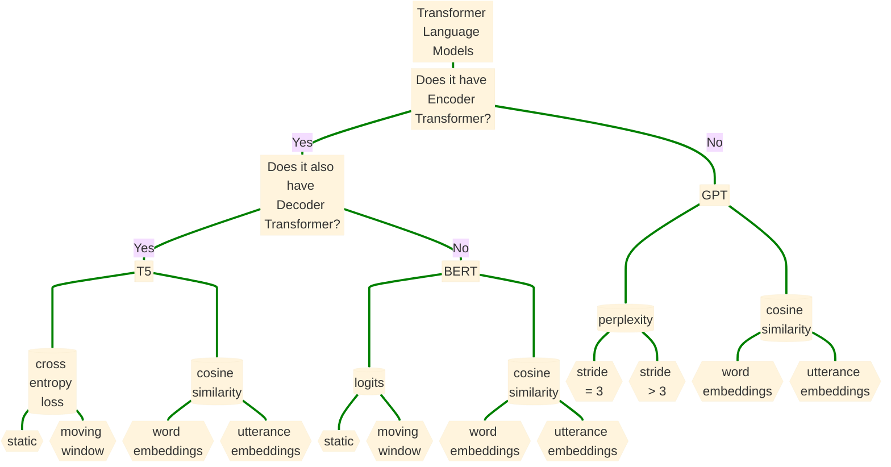

Using language models to improve accuracy of detecting language disturbances in Schizophrenia Spectrum Disorder Speech

To see detail, click on the node
---------------------------------------------

