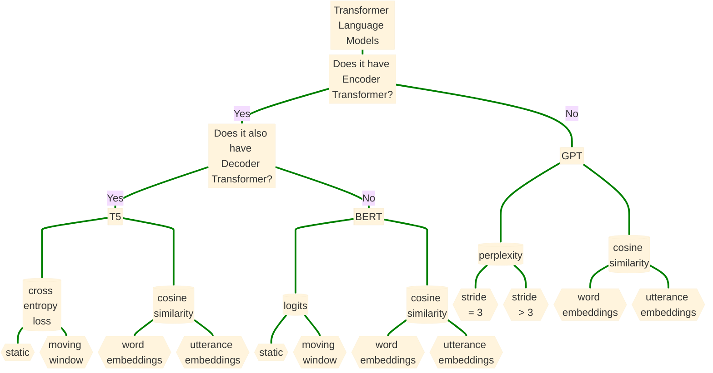

Using language models to improve accuracy of detecting language disturbances in Schizophrenia Spectrum Disorder Speech (click on the node to see detail)

---------------------------------------------

```mermaid
%%{init: {'theme': 'base', 'themeVariables': { 'fontSize': '100px'}}}%%
flowchart LR
    A[Embedding Strategy] ==> B[Measurement unit]
    B == Word ==> C[Language Models]
    C == Baseline ==> D[[GloVe]] ====> G[(Coherence within a window i, i=5,10)]
    G ==> J{{min, max, mean, std}}
    G ==> K{{5%, 95%, median, IQR}}
    D ====> P[(Coherence-Ki, \"similarity (abc) word_id,word_id+i\", i=2:10)]
    P ==> Q{{min, max, mean, std}}
    P ==> R{{5%, 95%, median, IQR}}
    C == Transformer ==> E[[BERT T5 GPT]] ====> H[(Coherence within a window i, i=5,10)]
    H ==> L{{min, max, mean, std}}
    H ==> M{{5%, 95%, median, IQR}}
    E ====> S[(Coherence-Ki, \"similarity (abc) word_id,word_id+i\", i=2:10)]
    S ==> T{{min, max, mean, std}}
    S ==> U{{5%, 95%, median, IQR}}
    B == Utterance ==> F[[Language Models]] ====> I[(GloVe)]
    I ==> N{{FOC}}
    I ==> O{{SOC}}
    N ==> a{{min, max, mean, std}}
    N ==> b{{5%, 95%, median, IQR}}
    O ==> c{{min, max, mean, std}}
    O ==> d{{5%, 95%, median, IQR}}
    F ====> V[(BERT T5 GPT)]
    V ==> W{{FOC}}
    V ==> X{{SOC}}
    W ==> e{{min, max, mean, std}}
    W ==> f{{5%, 95%, median, IQR}}
    X ==> g{{min, max, mean, std}}
    X ==> h{{5%, 95%, median, IQR}}
    
    
    linkStyle 0 stroke-width:17px,fill:none,stroke:green;
    linkStyle 1 stroke-width:17px,fill:none,stroke:green;
    linkStyle 2 stroke-width:17px,fill:none,stroke:green;
    linkStyle 3 stroke-width:17px,fill:none,stroke:green;
    linkStyle 4 stroke-width:17px,fill:none,stroke:green;
    linkStyle 5 stroke-width:17px,fill:none,stroke:green;
    linkStyle 6 stroke-width:17px,fill:none,stroke:green;
    linkStyle 7 stroke-width:17px,fill:none,stroke:green;
    linkStyle 8 stroke-width:17px,fill:none,stroke:green;
    linkStyle 9 stroke-width:17px,fill:none,stroke:green;
    linkStyle 10 stroke-width:17px,fill:none,stroke:green;
    linkStyle 11 stroke-width:17px,fill:none,stroke:green;
    linkStyle 12 stroke-width:17px,fill:none,stroke:green;
    linkStyle 13 stroke-width:17px,fill:none,stroke:green;
    linkStyle 14 stroke-width:17px,fill:none,stroke:green;
    linkStyle 15 stroke-width:17px,fill:none,stroke:green;
    linkStyle 16 stroke-width:17px,fill:none,stroke:green;
    linkStyle 17 stroke-width:17px,fill:none,stroke:green;
    linkStyle 18 stroke-width:17px,fill:none,stroke:green;
    linkStyle 19 stroke-width:17px,fill:none,stroke:green;
    linkStyle 20 stroke-width:17px,fill:none,stroke:green;
    linkStyle 21 stroke-width:17px,fill:none,stroke:green;
    linkStyle 22 stroke-width:17px,fill:none,stroke:green;
    linkStyle 23 stroke-width:17px,fill:none,stroke:green;
    linkStyle 24 stroke-width:17px,fill:none,stroke:green;
    linkStyle 25 stroke-width:17px,fill:none,stroke:green;
    linkStyle 26 stroke-width:17px,fill:none,stroke:green;
    linkStyle 27 stroke-width:17px,fill:none,stroke:green;
    linkStyle 28 stroke-width:17px,fill:none,stroke:green;
    linkStyle 29 stroke-width:17px,fill:none,stroke:green;
    linkStyle 30 stroke-width:17px,fill:none,stroke:green;
    
```
------------------------------------------------------------------


