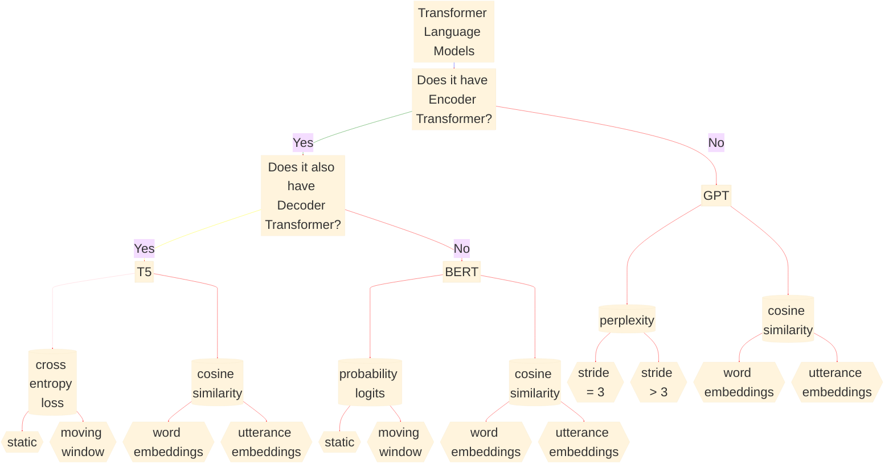

Using language models to improve accuracy in detecting language disturbance in Schizophrenia Spectrum Disorder Speech

---------------------------------------------

```mermaid
%%{init: {'theme': 'base', 'themeVariables': { 'fontSize': '100px'}}}%%
flowchart TD
    A[Transformer Language Models] ==> B[Does it have Encoder Transformer?]
    B == Yes ==> C[Does it also have Decoder Transformer?]
    C == Yes ==> D[[T5]] ====> G[(cross entropy loss)]
    G ==> J{{static}}
    G ==> K{{moving window}}
    D ====> P[(cosine similarity)]
    P ==> Q{{word embeddings}}
    P ==> R{{utterance embeddings}}
    C == No ==> E[[BERT]] ====> H[(probability logits)]
    H ==> L{{static}}
    H ==> M{{moving window}}
    E ====> S[(cosine similarity)]
    S ==> T{{word embeddings}}
    S ==> U{{utterance embeddings}}
    B == No ==> F[[GPT]] ====> I[(perplexity)]
    I ==> N{{stride = 3}}
    I ==> O{{stride > 3}}
    F ====> V[(cosine similarity)]
    V ==> W{{word embeddings}}
    V ==> X{{utterance embeddings}}
    click A "https://github.com/yancong222/scriptscz/blob/main/perplexity/ed_perplexity.py" _blank
    click B "http://www.github.com" "Open this in a new tab" _blank
    click C href "http://www.github.com" _blank
    click D href "http://www.github.com" "Open this in a new tab" _blank
    linkStyle 0 stroke-width:2px,fill:none,stroke:blue;
        linkStyle 1 stroke-width:2px,fill:none,stroke:green;
        linkStyle 2 stroke-width:2px,fill:none,stroke:yellow;
        linkStyle 3 stroke-width:2px,fill:none,stroke:pink;
        linkStyle default stroke-width:2px,fill:none,stroke:red;
```
